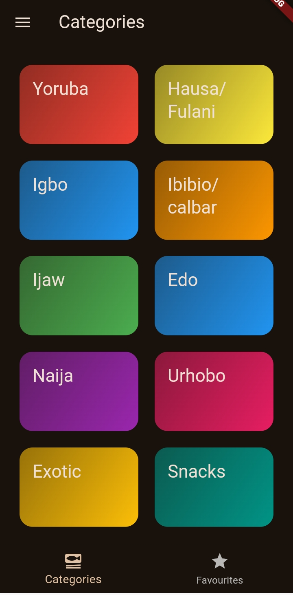
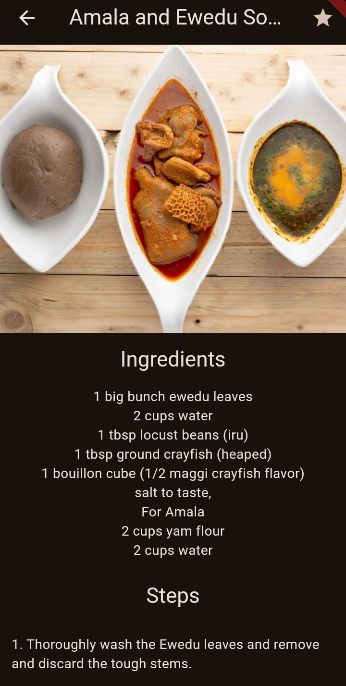
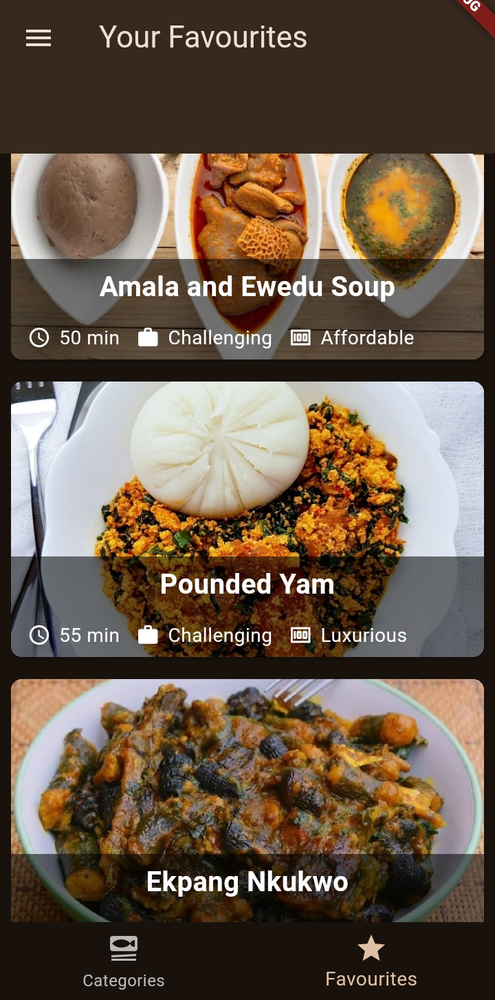
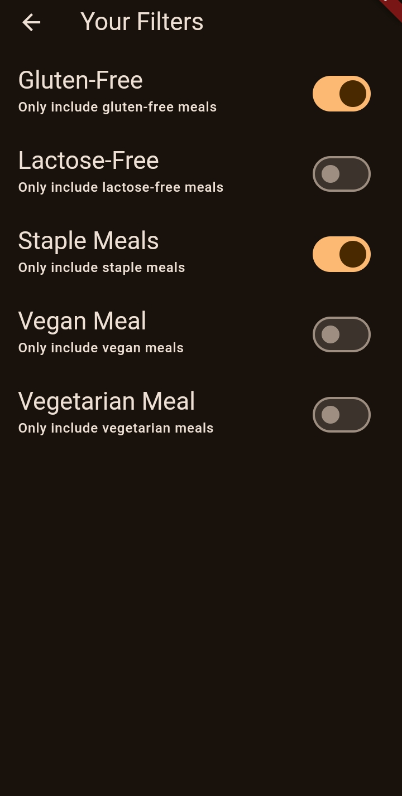

# Naija Meals

Naija Meals is a simple Flutter app that allows users to browse, view, and filter a collection of Nigerian meals. Users can mark their favorite meals, filter based on meal categories (like Vegan or Gluten-Free), and view meal details such as preparation time, complexity, and affordability. Each meal's ingredients, steps and video preparation is made available for users who would like to prepare it themselves.

## Features

- Browse meals by categories
- View meal details (ingredients, steps and video preparation)
- Mark meals as favorites
- Filter meals by:
  - Gluten-Free
  - Lactose-Free
  - Vegan
  - Vegetarian
  - Staple Meals

## Screenshots







## Folder Structure

```plaintext
lib/
├── data/              # Meals data
├── models/            # Data models
├── screens/           # UI screens
├── widgets/           # Reusable widgets
├── main.dart          # Entry point of the app
```

## Dependencies

The following packages are used in this project:

- [transparent_image](https://pub.dev/packages/transparent_image): For handling image placeholders
- [cupertino_icons](https://pub.dev/packages/cupertino_icons): For utilizing certain icons
- [google_fonts](https://pub.dev/packages/google_fonts): For utilizing certain fonts
- [flutter_riverpod](https://pub.dev/packages/flutter_riverpod): For state management
- [youtube_player_flutter](https://pub.dev/packages/youtube_player_flutter): For playing YouTube videos
- [flutter/material.dart](https://flutter.dev): Flutter's UI toolkit

## Contributing

If you'd like to contribute to this project, please fork the repository and submit a pull request. We welcome improvements and bug fixes!

## Acknowledgements

- Thanks to the Flutter team for the awesome framework.
- Nigerian cuisine inspirations from various recipe sources.